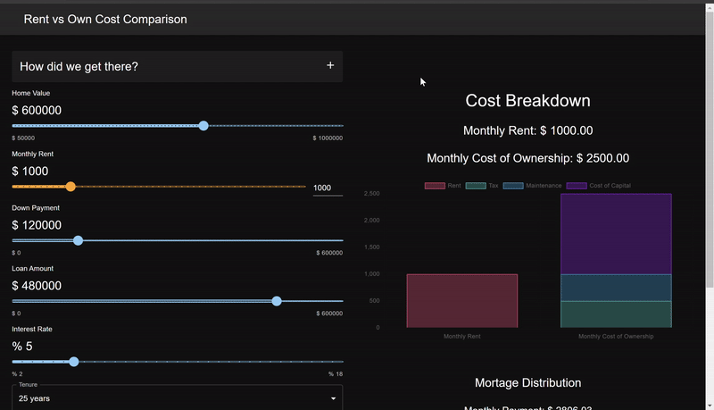

# Rent vs Own Web App

## Overview

Welcome to our Rent vs. Own Cost Comparison Web App! This application is designed to help users make informed decisions about housing options by comparing the costs associated with renting versus owning a home. Whether you are a prospective homebuyer or considering renewing your lease, this app provides a snapshot analysis to guide your decision-making process.

## It's Live!

Visit the web app [here!](https://amplify.d35xku6dxohz72.amplifyapp.com/)

## Demo

## Motivation

Feeling overwhelmed by the cost of rent is a common feeling in today's real estate landscape.
People tend to gravitate towards believing home ownership is the salvation to increasing rent prices.
This turns out to not always be the case.
This app aims to help users understand the costs of home ownership and get a sense if a rental may be a better suited option.

Upon visiting some resources such as the [wowa cost calculator](https://wowa.ca/calculators/rent-vs-buy-calculator), I felt like there were missing pieces. It was unclear how costs were being calculated and it did not consider the trade-off of having your capital tied up in a home vs being invested elsewhere.

This led me to [Ben Felix](https://www.pwlcapital.com/rent-or-own-your-home-5-rule/). Ben considers the cost of having your capital tied up in a home, the cost of depreciation and maintenance, and the cost of tax. His conservative estimates boil the cost of home ownership as 5% of the price of the home. A pretty (overly) simple benchmark as a jumping off point in this weighty decision. Why not give users an interactive experience where they can make adjustments in their rental costs and home ownership costs to

## Tech

## Feedback

We value your feedback! If you encounter any issues or have suggestions for improvement, please [open an issue](https://github.com/mkudrenecky/rent-vs-own-webapp/issues/new) on our GitHub repository. We're committed to enhancing the user experience and making this tool as helpful as possible.

Happy home decision-making! 🏡✨
